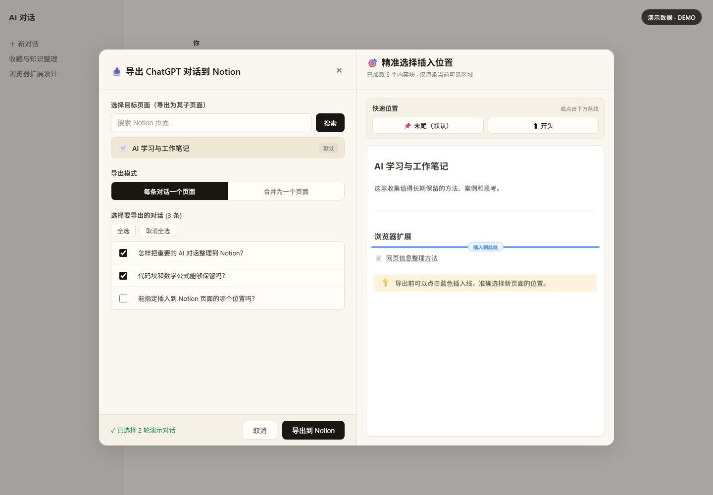
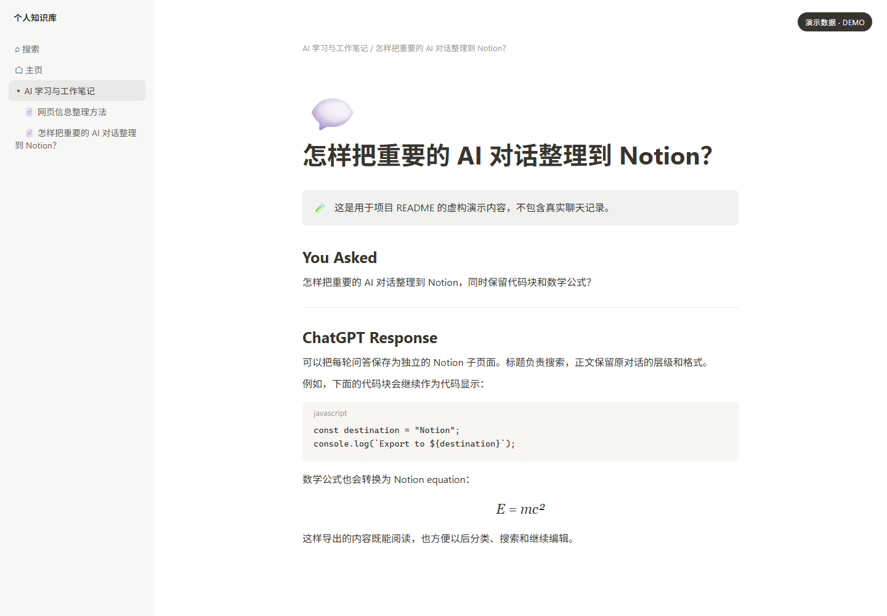

# AI Chat to Notion

将 Claude 和 ChatGPT 网页对话导出到 Notion 的 Chrome / Edge 浏览器扩展。

你可以选择需要保存的问答，把每轮对话分别创建为 Notion 子页面，或把多轮对话合并到一个页面；还可以选择插入到目标页面的开头、末尾或某个内容块之后。

无需 Claude API Key 或 OpenAI API Key。使用前需要创建自己的 Notion Integration，并把要写入的 Notion 页面授权给它。

> 本项目是非官方开源项目，与 Anthropic、OpenAI 和 Notion 没有隶属、合作或背书关系。





> 两张图片均使用虚构的演示数据，不包含真实聊天记录、Notion 页面或 Token。

## 主要功能

- 支持 `claude.ai`、`chatgpt.com` 和旧版 `chat.openai.com`。
- 自由勾选需要保存的问答，不会默认全选。
- 支持每轮对话分别创建子页面，或将多轮对话合并为一个页面。
- 可以导出到目标页面的开头、末尾，或预览页面后选择准确的插入位置。
- 支持段落、标题、代码块、列表、引用、表格、独立公式、行内公式、粗体、斜体、删除线、下划线和链接。
- ChatGPT 长对话会自动扫描当前活动分支，并恢复扫描前的滚动位置。
- 同一来源页面连续导出时，会在当前标签页内临时记住上次成功使用的 Notion 页面和位置。
- 导出失败时显示 Notion 返回的具体错误，便于排查权限、Token、网络或内容格式问题。

## 快速开始

### 1. 下载并加载扩展

1. 下载本仓库的 ZIP 文件并解压，或使用 Git 克隆仓库。
2. 在 Chrome 打开 `chrome://extensions/`，或在 Edge 打开 `edge://extensions/`。
3. 打开“开发者模式”。
4. 点击“加载已解压的扩展程序”，选择包含 `manifest.json` 的项目根目录。

更新项目文件后，需要回到扩展管理页面点击“重新加载”。

### 2. 创建 Notion Integration

Notion Integration 可以理解为一把只用于程序访问 Notion 的钥匙。扩展使用这把钥匙，把你选中的聊天内容写入你授权的页面。

1. 打开 [Notion Integrations](https://www.notion.so/profile/integrations)。
2. 创建一个新的 Internal Integration，例如命名为 `AI Chat Exporter`。
3. 选择要使用的 workspace。
4. 给它开启读取内容和插入内容所需的权限。
5. 创建后复制以 `ntn_` 开头的 Internal Integration Secret。

请不要把这个 Token 写进代码、截图、Issue 或公开聊天中。

### 3. 授权目标页面

1. 打开准备接收导出内容的 Notion 页面。
2. 点击页面右上角的 `•••` 菜单。
3. 选择 `Add connections`，搜索并添加刚创建的 Integration。

Integration 只能访问明确授权给它的页面及可访问的子内容。如果扩展搜索不到页面，通常是这一步尚未完成。

### 4. 配置并导出

1. 点击浏览器工具栏中的扩展图标。
2. 填写 Notion Integration Token。
3. 可选：填写默认父页面 ID。
4. 保存设置并点击“测试连接”。
5. 打开 Claude 或 ChatGPT 对话页面。
6. 点击页面左下角可拖动的 **N** 按钮。
7. 选择 Notion 页面和导出模式，勾选需要导出的对话。
8. 使用右侧面板选择插入位置，然后点击“导出到 Notion”。

## 导出后的结构

选择“每条对话一个页面”时，每轮问答会创建一个 Notion 子页面：

```text
页面标题：用户问题

You Asked
用户问题正文

────────────

Claude Response / ChatGPT Response
AI 回答正文
```

选择“合并为一个页面”时，多轮问答会按照原顺序写入同一个子页面，并在各轮之间加入分隔线。

## 数据和隐私

扩展直接读取当前 Claude / ChatGPT 页面的 DOM，也就是浏览器已经显示出来的网页结构，不调用 Claude API 或 OpenAI API。选中的内容只会发送给 Notion API，用于读取授权页面和完成导出；项目没有开发者服务器、账户系统、统计分析或广告服务。

Notion Token、默认页面信息和浮动按钮位置保存在浏览器扩展的本地存储中。聊天快照、来源页面地址和最近一次导出位置只在当前标签页内存中临时保留，刷新或关闭标签页后消失。

完整说明和清除方法请阅读 [PRIVACY.md](PRIVACY.md)。

## 当前限制

- ChatGPT 只导出当前活动的回答分支，不导出其他分支。
- Claude 只能导出当前网页已经加载到 DOM 中的内容。
- 正在生成的回答只能导出扫描结束时已经显示的部分。
- 上传附件、生成图片、Canvas 和隐藏推理过程暂不导出。
- 只有图片或附件、没有文字的消息会保留占位说明，不会保存文件本身。
- Claude、ChatGPT 或 Notion 的网页结构和 API 发生变化后，扩展可能需要更新。
- 当前版本需要使用者自行创建 Notion Internal Integration，不提供面向普通用户的 OAuth 登录流程。

## 常见问题

### 搜索不到 Notion 页面

确认目标页面已经通过 `•••` → `Add connections` 授权给你的 Integration，然后重新点击“测试连接”。

### 提示 Token 或权限错误

确认 Token 完整有效、Integration 仍然存在，并且拥有读取和插入内容的权限。不要在 Issue 中粘贴 Token。

### 页面上没有出现 N 按钮

确认当前地址属于支持的网站，并在扩展管理页面重新加载扩展，然后刷新对话页面。

### 检测不到完整对话

先等待当前回答生成完成再重试。ChatGPT 会虚拟化长对话；扩展会滚动扫描当前分支。如果无法确认已经到达末尾，扩展会明确报错，而不会把不完整列表当成成功结果。

## 开发说明

项目使用 Manifest V3 和原生 JavaScript，不依赖 npm 包，也不需要构建步骤。

```text
ai-chat-to-notion/
├── manifest.json
├── background.js               # Notion API 请求代理
├── popup.html / popup.js       # Token 和默认页面设置
├── content/
│   ├── extractor.js            # Claude / ChatGPT DOM 适配器
│   ├── chatgpt-cache.js         # 当前标签页缓存和长对话扫描
│   ├── converter.js            # HTML DOM 转换为 Notion Blocks
│   ├── builder.js              # 构建问答页面内容
│   ├── api.js                  # content script 消息封装
│   ├── ui-*.js                 # 浮动按钮、导出面板和位置选择
│   └── *.css
├── tests/                       # 无依赖的浏览器回归夹具
├── docs/                        # README 演示图和可复现页面
└── INDEX.md                     # 代码导航与架构索引
```

基础语法和清单检查：

```powershell
$files = @('background.js', 'popup.js') + (Get-ChildItem content -Filter *.js).FullName
foreach ($file in $files) { node --check $file }
Get-Content -Raw -Encoding UTF8 manifest.json | ConvertFrom-Json | Out-Null
```

`tests/` 中的 HTML 文件覆盖 DOM 提取、长对话缓存、导出面板、精准位置选择、公式与引用预览、上次导出位置以及错误显示。可以直接用浏览器打开对应文件，页面顶部显示 `PASS` 代表该专项回归通过。

版本变化见 [CHANGELOG.md](CHANGELOG.md)。提交公开 Issue 前，请先删除聊天内容、Notion 页面名称、页面 ID 和 Token 等私人信息。

## License

本项目使用 [MIT License](LICENSE)。你可以使用、修改和分发代码，但必须保留原版权与许可声明。
